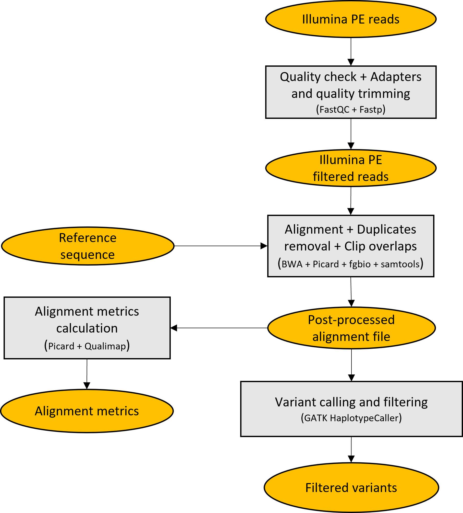

# Illumina_variant_calling

**Illumina_variant_calling** is a pipeline for performing quality check, alignment and small variant calling with Illumina paired-end reads.

<p align="center">
  
</p>

## Getting started

**Prerequisites**

* Miniconda3.
Tested with conda 4.10.3.
```which conda``` should return the path to the executable.
If you don't have Miniconda3 installed, you could download and install it with:
```
wget https://repo.anaconda.com/miniconda/Miniconda3-latest-Linux-x86_64.sh
chmod 755 Miniconda3-latest-Linux-x86_64.sh
./Miniconda3-latest-Linux-x86_64.sh
```

Then, after completing **Illumina\_variant\_calling** installation, set the _MINICONDA\_DIR_ variable in **config_Variant_calling_pipeline.sh** to the full path to miniconda3 directory.

* A reference sequence in fasta format

* A pair of fastq files containing R1 and R2 paired-end Illumina reads


**Installation**

```
git clone https://github.com/MaestSi/Illumina_variant_calling.git
cd Illumina_variant_calling
chmod 755 *
./install.sh
```

A conda environment named _Illumina\_variant\_calling_env_ is created, where fastqc, fastp, samtools, bwa, picard, gatk and qualimap are installed.
Then, you can open the **config\_Variant\_calling\_pipeline.sh** file with a text editor and set the variables _PIPELINE_DIR_ and _MINICONDA_DIR_ to the value suggested by the installation step.

## Usage


**Variant_calling_pipeline.sh**

Usage:
./Variant_calling_pipeline.sh -1 \<sample\_name_reads_R1.fastq\> -2 \<sample\_name_reads_R2.fastq\> -r \<reference.fasta\>

**Note**: activate the conda environment before running.

Inputs:

* \<sample\_name_reads_R1.fastq\>: fastq file containing R1 reads
* \<sample\_name_reads_R2.fastq\>: fastq file containing R2 reads
* \<reference.fasta\>: fasta sequence to be used as a reference for alignment and variant calling

Outputs:
* QC: folder containing many sequencing and mapping quality reports
* \<sample\_name\_mapped\_to_\<reference_name\>\_MarkDup\_Clipped.bam: post-processed bam file
* \<sample\_name\>.variants.filtered.vcf.gz: vcf file containing filtered variants
* \<sample\_name\>.complete.raw.g.vcf.gz: gvcf file containing genotype at each genomic locus

